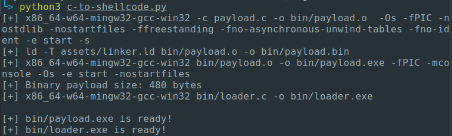
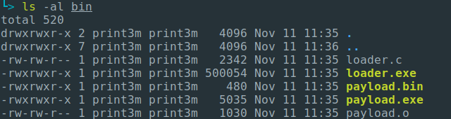

# c-to-shellcode.py

It's a simple Python script to easily convert C code to shellcode (standalone binary machine code) with one command 👾🐚

Dependencies:

- Python 3.x
- x86_64-w64-mingw32-gcc-win32
- ld




## Usage

1. Write something cool to `payload.c`
2. Execute: `python c-to-shellcode.py`
3. Look at the `bin/` directory:
   - `payload.exe` - compiled C program (without shellcode conversion), so you can use libc and WinAPI functions directly, e.g. `printf()`. Great for debugging and fast development.
   - `loader.exe` - loader with compiled shellcode. It really injects shellcode into memory and executes it just like real malware.
   - `payload.bin` - raw standalone shellcode binary file.



## Caveats

- There's no external functions! No linkage to libc or win32. However, you are still able to include header files and use **macros** and **types** only. If you see linker errors during compilation then you are probably using some external functions. You have to implement everything on your own here.
- Global variables are not available.
- Use `ALIGN_STACK()` macro directly before any WinAPI call! The 16-bytes stack alignment is required for WinAPI functions.
- Use `FUNC` macro before function header (except `main`):

```c
FUNC int ExampleFunction() { ... } 
```

- All strings have to be stack based:

```c
int main(void) {
    // Stack based string
    char string[] = {'t', 'e', 's', 't', '\0'};
}
```
